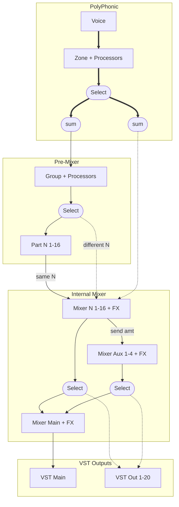

# Voice Routing

All voices are associated with a zone. How they get from that zone
to the output and what happens is a bit tricky. So write it down

## Core Concepts

### VST Output

ShortCircuit has 21 stereo VST outputs, named "main", "output 1-20".
These are just audio outputs. We will call them "VST main out", "VST out 1-20"
to avoid confusion in this document

### Internal mixer buses

ShortCircuit has a concept of an internal 'mixer' bus. A mixer bus
has the following properties

1. It has a stereo signal
2. It has up to 4 effects, chained linearly
3. It optionally has 4 aux sends
4. It has a level (VCA)

Short circuit has 21 internal mixer buses. Main, Part 1-16, and Aux 1-4. To
avoid confusion with VST we will call these "Mixer Main", "Mixer Part N"
and "Mixer Aux N".

By default, Mixer Main outputs to VST Main, Mixer Part N outputs to
VST Main (if ShortCircuit is configured with a single Stereo out in your daw)
or VST out N (if not) and Mixer Aux N merges into Mixer Main.

## Voice Routing

A voice is associated with a zone, which is in turn associated with a
group and a part.

The default routing for a voice is the voice accumulates to its group,
runs any group processors, accumulates to its part, and its part sends
to its mixer bus to run part effects.

An individual zone can override this to accumulate directly to a mixer bus,
skipping the group processor and using the mixer effects of that bus.

An individual group can override this to accumulate to a mixer bus other
than the part default mixer bus, and using the mixer effects of that bus

## In Pictures

